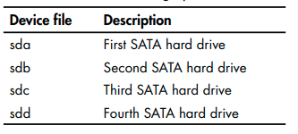

# Linux Note

- [Linux Note](#linux-note)
  - [1. Basics](#1-basics)
    - [Basic Commands](#basic-commands)
    - [Viewing Files](#viewing-files)
      - [Finding the head and tail of a file](#finding-the-head-and-tail-of-a-file)
      - [Numbering the lines of a file](#numbering-the-lines-of-a-file)
      - [`more` and `less` commands](#more-and-less-commands)
    - [Find Files and Directories](#find-files-and-directories)
      - [`Locate` Command](#locate-command)
      - [Find Binaries using `whereis`](#find-binaries-using-whereis)
      - [Find Binaries in PATH using `which`](#find-binaries-in-path-using-which)
      - [`find` Command](#find-command)
      - [`grep` Command](#grep-command)
      - [`sed` Command to find and replace](#sed-command-to-find-and-replace)
  - [2. Analyzing and Managing Networks](#2-analyzing-and-managing-networks)
    - [Changing Network Information](#changing-network-information)
      - [Changing IP Address](#changing-ip-address)
      - [Changing Netmask and Broadcast Address](#changing-netmask-and-broadcast-address)
      - [Spoofing MAC Address](#spoofing-mac-address)
      - [Assign new IP to DHCP Client](#assign-new-ip-to-dhcp-client)
    - [Manipulating DNS](#manipulating-dns)
      - [`dig` Command](#dig-command)
      - [Change DNS Server](#change-dns-server)
      - [Mappping own IP Address](#mappping-own-ip-address)
  - [3. File and Directory Permissions](#3-file-and-directory-permissions)
    - [Granting Permission](#granting-permission)
      - [Three Levels of Permission](#three-levels-of-permission)
      - [Change Ownership - `chown`](#change-ownership---chown)
      - [Change Group Ownership - `chgrp`](#change-group-ownership---chgrp)
      - [check permission](#check-permission)
    - [Changing Permission](#changing-permission)
      - [using decimal notaion](#using-decimal-notaion)
      - [Changing Permission with UGO](#changing-permission-with-ugo)
      - [Setting permission with Masks](#setting-permission-with-masks)
    - [Special Permission](#special-permission)
    - [Users and Groups permissions using `Visudo`](#users-and-groups-permissions-using-visudo)
      - [Adding User to Group](#adding-user-to-group)
      - [Add a new user](#add-a-new-user)
      - [Delete a user](#delete-a-user)
      - [Switch User](#switch-user)
      - [Sudoers File](#sudoers-file)
      - [Create a new group](#create-a-new-group)
  - [4. Process Management](#4-process-management)
    - [Viewing Process](#viewing-process)
    - [Managing Process](#managing-process)
      - [Change Process Priority with `nice` and `renice`](#change-process-priority-with-nice-and-renice)
      - [Killing Process](#killing-process)
      - [Running Process in Background](#running-process-in-background)
      - [Running Process in Foreground](#running-process-in-foreground)
    - [Scheduling Process](#scheduling-process)
      - [`at` Command](#at-command)
    - [Ram Usage](#ram-usage)
      - [`free` Command](#free-command)
  - [5. User Environment Variables](#5-user-environment-variables)
    - [viewing Environment Variables](#viewing-environment-variables)
      - [default environment variables](#default-environment-variables)
      - [Viewing all environment variables](#viewing-all-environment-variables)
      - [Changing Variable for a session](#changing-variable-for-a-session)
      - [Changing Variable Permanently](#changing-variable-permanently)
    - [Changing PATH](#changing-path)
      - [Adding to the PATH Variable](#adding-to-the-path-variable)
      - [Create a user defined variable](#create-a-user-defined-variable)
  - [6. Compressing and Archiving Files](#6-compressing-and-archiving-files)
    - [Taring Files](#taring-files)
    - [Compressing Files](#compressing-files)
      - [Gzip](#gzip)
      - [Bzip2](#bzip2)
      - [Compress](#compress)
    - [Create Physical Copy of Storage](#create-physical-copy-of-storage)
      - [`dd` Command](#dd-command)
    - [Zip and Unzip](#zip-and-unzip)
  - [7. File System Management](#7-file-system-management)
    - [Linux Device Naming System](#linux-device-naming-system)
    - [Device Partitioning](#device-partitioning)
      - [`fdisk` Command](#fdisk-command)
      - [Character and Block Devices](#character-and-block-devices)
    - [Mounting and Unmounting File Systems](#mounting-and-unmounting-file-systems)
    - [Monitoring FileSystem](#monitoring-filesystem)
      - [`df` Command](#df-command)
      - [Checking for Errors : `fsck`](#checking-for-errors--fsck)
    - [Disk Usage](#disk-usage)
      - [`du` Command](#du-command)
  - [8. Logging System](#8-logging-system)
    - [rsyslog Logging Daemon](#rsyslog-logging-daemon)
      - [rsyslog logging rules](#rsyslog-logging-rules)
      - [Cleaning Up Logs with `logrotate`](#cleaning-up-logs-with-logrotate)
    - [Remaining Stealthy](#remaining-stealthy)
      - [`shred` Command](#shred-command)
      - [Disabling Logging](#disabling-logging)
      - [Delete Bash History](#delete-bash-history)
  - [9. Linux Services](#9-linux-services)
    - [Start, Stop and Restart Services](#start-stop-and-restart-services)
      - [`service` Command](#service-command)
    - [view all services](#view-all-services)
    - [MySQL Service](#mysql-service)
      - [Starting MySQL Service](#starting-mysql-service)
      - [Authentication](#authentication)
      - [Setting Password](#setting-password)
      - [Accessing Remote MySQL](#accessing-remote-mysql)
      - [Connecting to MySQL Database](#connecting-to-mysql-database)
      - [Database Table](#database-table)
      - [Data Manipulation](#data-manipulation)
    - [Postgres with Metasploit](#postgres-with-metasploit)
    - [Apache Web Server](#apache-web-server)
    - [SSH Service](#ssh-service)
    - [Start and Stop Services at Boot](#start-and-stop-services-at-boot)
    - [reload entire systemd daemon](#reload-entire-systemd-daemon)
  - [10. Linux Security](#10-linux-security)
    - [traceroute](#traceroute)
    - [The Onion Router (Tor)](#the-onion-router-tor)
      - [Verify Signature after Download](#verify-signature-after-download)
    - [Proxy Chains](#proxy-chains)
      - [Setting up Proxy Chains](#setting-up-proxy-chains)
      - [Dynamic Chainning](#dynamic-chainning)
      - [Random Chainning](#random-chainning)
  - [11. Linux Kernel Management and Enumeration](#11-linux-kernel-management-and-enumeration)
    - [Checking Kernel Version](#checking-kernel-version)
    - [Kernel Tuning with `sysctl`](#kernel-tuning-with-sysctl)
    - [Managing Kernel Modules](#managing-kernel-modules)
      - [insmod Suite](#insmod-suite)
      - [modprobe Command](#modprobe-command)
    - [Check CPU Information](#check-cpu-information)
  - [12. Job Scheduling](#12-job-scheduling)
    - [Cron Jobs](#cron-jobs)
      - [Scheduling a backup job](#scheduling-a-backup-job)
      - [Crontab shortcuts](#crontab-shortcuts)
    - [rc Scripts](#rc-scripts)
      - [Linux Run Levels](#linux-run-levels)
      - [Adding a Service to rc.d](#adding-a-service-to-rcd)
      - [Add service via GUI: rcconf](#add-service-via-gui-rcconf)
  - [13. SSH and SSH Security](#13-ssh-and-ssh-security)
    - [Connecting to SSH Server](#connecting-to-ssh-server)
    - [Disable Root Login](#disable-root-login)
    - [Lock Password for Root](#lock-password-for-root)
    - [Login through SSH Key](#login-through-ssh-key)
    - [Disable Password Authentication](#disable-password-authentication)
    - [Protect ssh private key](#protect-ssh-private-key)
    - [`scp` uitility](#scp-uitility)
    - [SSH Brute Force Protection with `fail2ban`](#ssh-brute-force-protection-with-fail2ban)
  - [14. Linux Firewall](#14-linux-firewall)
    - [IPTables](#iptables)
    - [UFW (Uncomplicated Firewall)](#ufw-uncomplicated-firewall)
  - [15. Other Tools](#15-other-tools)
    - [`Curl`](#curl)
    - [Web Search From Terminal using ZSH](#web-search-from-terminal-using-zsh)
  - [16. Bash Scripting](#16-bash-scripting)

## 1. Basics

### Basic Commands

```Bash
pwd # present working directory
ls # list files
whoami # current user
who # shows who is logged in

hostname # host name
# or use
sudo cat /etc/hostname # host name


id # user id
cd # change directory
ls -al # using flags
nmap -h # help
man nmap # manual

# create file
touch file_name

# create directory
mkdir directory_name

# remove file
rm file_name

# remove directory if empty
rmdir directory_name
# remove directory with content
rm -r directory_name

# copy file
cp source_file destination_file

# move or rename file
mv old_file new_file

# whatis command: get information about a command
whatis command_name

# tldr command: get a quick help
sudo apt install tldr
tldr command_name
```

### Viewing Files

```Bash
# cat command

cat file_name # display file content
cat > file_name # create file
cat >> file_name # append to file
```

#### Finding the head and tail of a file

```Bash
head file_name
head -20 file_name # display first 20 lines
tail file_name
tail -20 file_name # display last 20 lines
```

#### Numbering the lines of a file

```Bash
nl file_name
```

#### `more` and `less` commands

```Bash
more file_name
less file_name
```

- `/` to search in `less` command

### Find Files and Directories

#### `Locate` Command

```Bash
locate file_name
locate -all "pattern" # search for pattern

locate /etc -all "pattern" # search in /etc directory 
# or use this
locate "pattern" | grep "/etc/"

locate -i "pattern" # case insensitive search
updatedb # update the database
```

#### Find Binaries using `whereis`

```Bash
whereis ls
```

#### Find Binaries in PATH using `which`

```Bash
which ls
```

#### `find` Command

```Bash
# Structure
find directory options expressions

find / -type f -name apache2
find /etc -type f -name apache2
find /etc -type f -name apache2.\* # find files with apache2 prefix
find / -type d -name apache2 # find directories
```

#### `grep` Command

```Bash
# To search a string in a file
grep 'string' filename

# filter with grep
ps aux | grep 'apache2'
cat /etc/snort/snort.conf | grep 'output'

# To recursively search all files inside a directory
grep -rl 'string' directory_name
## r: recursive, l: file name

# to omit case sensitivity
grep -i 'string' filename
```

#### `sed` Command to find and replace

```Bash
sed s/mysql/MySQL/g /etc/snort/snort.conf > snort2.conf
## s: substitute, g: global
sed s/mysql/MySQL/2 /etc/snort/snort.conf > snort2.conf
## 2: second occurrence
```

---
---

## 2. Analyzing and Managing Networks

```Bash
ifconfig # interface configuration
iwconfig # wireless interface configuration
```

### Changing Network Information

#### Changing IP Address

```Bash
ifconfig eth0 <new ip address>
```

#### Changing Netmask and Broadcast Address

```Bash
ifconfig eth0 192.168.23.12 netmask <new netmask> broadcast <new broadcast address>
```

#### Spoofing MAC Address

```Bash
ifconfig eth0 down
ifconfig eth0 hw ether <new mac addr: 00:11:22:33:44:55>
ifconfig eth0 up
```

#### Assign new IP to DHCP Client

```Bash
dhclient eth0
```

- if it doesn't work use `dhclient -r eth0` to release the current IP.

### Manipulating DNS

#### `dig` Command

```Bash
dig google.com
dig google.com mx # mail exchange
dig google.com ns # name server
```

#### Change DNS Server

- open `/etc/resolv.conf`.
- add `nameserver` followed by the IP address of the DNS server.

#### Mappping own IP Address

- Add the IP address and hostname in `/etc/hosts`. Use Tab to separate the IP and hostname.

---
---

## 3. File and Directory Permissions

### Granting Permission

#### Three Levels of Permission


#### Change Ownership - `chown`

```Bash
chown user_name file_name
chown user_name:group_name file_name
```

#### Change Group Ownership - `chgrp`

```Bash
chgrp group_name file_name
```

#### check permission

```Bash
ls -l
ls -al # to see hidden files
```


- First character: `-` for file, `d` for directory, `l` for link and `.` for hidden files.
- The next three characters are for the owner, the next three for the group and the last three for others.

### Changing Permission

#### using decimal notaion

| Binary | Octal | rwx |
| ------: | -----: | ---: |
| 000    | 0     | --- |
| 001    | 1     | --x |
| 010    | 2     | -w- |
| 011    | 3     | -wx |
| 100    | 4     | r-- |
| 101    | 5     | r-x |
| 110    | 6     | rw- |
| 111    | 7     | rwx |

- it goes something like this: for `rw-` you need `4+2 (110) = 6`.
- for `r-x` you need `4+1 (101) = 5`.
- for `rwx` you need `4+2+1 (111)= 7`.
- to give owner all the permission 7 is needed.
- To give permission to all owner, group and others `777` is needed. `777` comes from `rwxrwxrwx` = `777`.

```Bash
chmod 777 file_name # give all permission
chmod 755 file_name # give owner all permission, group and others read and execute permission
```

#### Changing Permission with UGO

- UGO stands for User, Group and Others.
- `+` is used to add permission, `-` is used to remove permission and `=` is used to set permission.

```Bash
chomod u-x file_name # remove execute permission from owner
chmod g+w file_name # add write permission to group
chmod o-r file_name # remove read permission from others
chmod u+x o+x file_name # add execute permission to owner and others
```

#### Setting permission with Masks

- Linux automatically assigns base permissions—usually
666 for files and 777 for directories.
- The `umask` command is used to set the default permission for files and directories. when a new file or directory is created, its permissions are set to the default value minus the value in umask.


To view default permission use `umask` command.

```Bash
umask # Kali Linux default is 002
```

### Special Permission

- In addition to the three general-purpose permissions, rwx, Linux has three special permissions that are slightly more complicated. These special permissions are set user ID (or `SUID`), set group ID (or `SGID`), and `sticky bit`.

### Users and Groups permissions using `Visudo`

#### Adding User to Group

```Bash
usermod -aG group_name user_name
```

#### Add a new user

```Bash
# add new user with home directory
sudo useradd -m new_user
# add new user with home directory and shell
sudo useradd -m -s /bin/bash new_user
# add new user without home directory
sudo useradd new_user

sudo useradd -m -C "Full Name" -s /bin/bash new_user # add user with full name

# set password
sudo passwd new_user # set password
```

#### Delete a user

```Bash
sudo userdel -r user_name # delete user and home directory
```

#### Switch User

```Bash
su user_name # switch to user
su - user_name # switch to user with environment
```

#### Sudoers File

- The sudoers file is located at `/etc/sudoers`.

```Bash
sudo visudo # edit sudoers file
```

- The sudoers file is divided into three sections: User privilege specification, User alias specification, and Command alias specification.
- root ALL=(ALL:ALL) ALL : root can run all commands on all hosts as all users and groups.

#### Create a new group

```Bash
sudo groupadd group_name
```

---
---

## 4. Process Management

### Viewing Process

```Bash
ps # process status
ps aux # all process
ps aux | grep 'apache2' # filter process
# find the greedy process
top
# or
htop
```

### Managing Process

#### Change Process Priority with `nice` and `renice`

niceness prioriy values


```Bash
nice -n 10 command # set priority to 10
nice -n -10 /bin/slowprocess # set priority to -10
```

changing prioriy of a running process

```Bash
renice 10 6996 # change priority of process with PID 6996 to 10
```

#### Killing Process

Common Kill Signals


```Bash
kill -9 6996 # kill process with PID 6996
kill -1 6996 # hangup
kill -9 process_name # kill process by name
```

#### Running Process in Background

```Bash
command & # run command in background
```

#### Running Process in Foreground

```Bash
fg # bring background process to foreground
```

### Scheduling Process

#### `at` Command

```Bash
at 10:00 PM # run at 10:00 PM
at> ls -l # command to run
at> <EOT> # to end
```

### Ram Usage

#### `free` Command

```Bash
free # check memory usage
free -h # check memory usage in human readable format
```

---
---

## 5. User Environment Variables

### viewing Environment Variables

#### default environment variables

```Bash
env
```

#### Viewing all environment variables

```Bash
set | more
# filter with grep
set | grep HISTSIZE
```

#### Changing Variable for a session

```Bash
HISTSIZE=100
```

#### Changing Variable Permanently

```Bash
HISTSIZE=100
export HISTSIZE
```

### Changing PATH

#### Adding to the PATH Variable

```Bash
PATH=$PATH:/usr/local/bin
export PATH
```

#### Create a user defined variable

```Bash
MYVAR=Hello
export MYVAR
unset MYVAR # remove variable
```

---
---

## 6. Compressing and Archiving Files

### Taring Files

- Tar stands for tape archive. It combines multiple files into a single file.

```Bash
tar -cvf archive_name.tar file1 file2 file3 # create archive
## here c: create, v: verbose, f: file

tar -xvf archive_name.tar # extract archive
## here x: extract

tar -tvf archive_name.tar # list files in archive without extracting
## here t: list

tar -xf archiive_name.tar # extract archive silently

tar -xvf archive_name.tar -C /tmp # extract archive to /tmp
```

### Compressing Files

- `gzip`, which uses the extension `.tar.gz` or `.tgz`
- `bzip2`, which uses the extension `.tar.bz2`
- `compress`, which uses the extension `.tar.z`
- compress is the fastest, but the resultant files are larger; bzip2 is the slowest, but the resultant files are the smallest; and gzip falls somewhere in between.

#### Gzip

```Bash
gzip file_name # compress file
gunzip file_name.tar.gz # unzip file
```

#### Bzip2

```Bash
bzip2 file_name # compress file
bunzip2 file_name.tar.bz2 # unzip file
```

#### Compress

```Bash
compress file_name # compress file
uncompress file_name.tar.z # unzip file
```

### Create Physical Copy of Storage

#### `dd` Command

```Bash
dd if=inputfile of=outputfile
dd if=/dev/sda of=/dev/sdb
dd if=/dev/media of=/root/flashcopy bs=4096 conv:noerror # copy media to flashcopy
## bs: block size, conv: conversion
```

### Zip and Unzip

```Bash
zip -r archive_name.zip file1 file2 file3 # create zip archive
unzip archive_name.zip # extract zip archive
```

- Unzipping multipart zip files: `.zip.001`, `.zip.002`, etc.

```Bash
cat test.zip* > ~/test.zip
unzip ~/test.zip
```

- Unzipping multi-disc zip files: `.zip`, `.z01`, `.z02`, etc.

```Bash
zip -F (name of last part of archive, which will end with .zip, not .z0X) --out (desired output name of compiled archive, if has spaces put " marks around the name).zip

unzip (full archive name, with " marks around it if has spaces).zip -d (destination folder directory, see first step)
```

---
---

## 7. File System Management

### Linux Device Naming System



### Device Partitioning

Partitioning is the process of dividing a storage device into multiple logical storage units. Each partition is treated as a separate storage device by the operating system.


#### `fdisk` Command

```Bash
fdisk -l # list all partitions
fdisk /dev/sda # open partition
```

#### Character and Block Devices

- The naming of device files in the /dev directory is that the first position contains either c or b.
- These letters represent the two ways that devices transfer data in and out. The c stands for character, and these devices are known, as you might expect, as character devices. External devices that interact with the system by sending and receiving data character by character, such as mice or keyboards, are character devices.
- The b stands for the second type: block devices. They communicate in blocks of data (multiple bytes at a time) and include devices like hard drives and DVD drives


- `lsblk` command is used to list block devices.

```Bash
lsblk
```

### Mounting and Unmounting File Systems

- Mounting is the process of attaching a file system to a directory in the file system tree. The two main mount points in Linux are `/mnt` and `/media`.

```Bash
mount /dev/sdb1 /mnt # mount device to /mnt
umount /mnt # unmount device
```

- The filesystems on a system that are mounted at boot-time are kept in a file at /etc/fstab (short for filesystem table), which is read by the system at every bootup.

### Monitoring FileSystem

#### `df` Command

```Bash
df # display disk usage
df -h # display disk usage
df -h | grep sd # display only drives with sd
df -ht ext4 # display only ext4 file system
```

#### Checking for Errors : `fsck`

- The fsck command (short for filesystem check) checks the filesystem for errors and repairs the damage, if possible, or else puts the bad area into a bad blocks table to mark it as bad.

```Bash
fsck # check file system
# First unmount the file system
umount /dev/sdb1

fsck /dev/sdb1 # check file system
fsck -p /dev/sdb1 # check file system and repair automatically
```

### Disk Usage

#### `du` Command

```Bash
du # disk usage
du -h # disk usage
du -sh /var # disk usage of /var directory
du -sh * # disk usage of all files in current directory
du -shc * # disk usage of all files in current directory with total
```

---
---

## 8. Logging System

### rsyslog Logging Daemon

- The rsyslog daemon is the default logging daemon in most Linux distributions. It is responsible for logging system messages.

```Bash
locate ryslog # locate rsyslog
```

- configuration file is located at `/etc/rsyslog.conf`.

#### rsyslog logging rules

- The basic format for these rules is as follows: `facility.priority  action`
- The facility keyword references the program, such as mail, kernel, or lpr, whose messages are being logged. The priority keyword determines what kind of messages to log for that program. The action keyword, on the far right, references the location where the log will be sent.

- The following is a list of valid codes that can be used in place of the
facility keyword in our configuration file rules:

| Facility | Description |
| --- | --- |
|auth, authpriv | Security/authorization messages |
|cron | Clock daemon messages |
|daemon | Other daemons |
|kern | Kernel messages |
|lpr | Line printer subsystem |
|mail | Mail system |
|mark | Timestamps |
|user | Generic User-level messages |

- An asterisk wildcard (*) in place of a word refers to all facilities.

- Here’s the full list of valid codes for priority:

  - debug
  - info
  - notice
  - warning
  - warn
  - error
  - err
  - crit
  - alert
  - emerg
  - panic
- The codes warn, error, and panic have all been deprecated and should not be used.
- The action is usually a filename and location where the logs should be sent. Note that generally, log files are sent to the /var/log directory with a filename that describes the facility that generated them, such as auth.

```Bash
# Example
mail.* /var/log/mail # log all mail messages to /var/log/mail
kern.crit /var/log/kernel # log all critical or higher level kernel messages to /var/log/kernel
*.emerg :omusmsg:* # log all emergency messages to all users
```

#### Cleaning Up Logs with `logrotate`

- The logrotate command is used to rotate, compress, and remove log files. Configure the logrotate utility to choose the regularity of your log rotation with the `/etc/logrotate.conf` text file.

### Remaining Stealthy

#### `shred` Command

- The shred command is used to overwrite a file to hide its contents.

```Bash
shred --help
shred <File> # overwrite file
shred -f -n 10 /var/log/auth.log.* # overwrite file 10 times
## f: force, n: number of times
shred -vfzu /var/log/auth.log.* # overwrite file 3 times, remove and truncate
## v: verbose, z: zero out, u: remove
```

#### Disabling Logging

- To disable logging, you can stop the rsyslog service.

```Bash
service rsyslog stop # stop rsyslog service
# or
systemctl stop rsyslog # stop rsyslog service
```

#### Delete Bash History

- The bash history file is located at `~/.bash_history`.

```Bash
> ~/.bash_history # clear bash history. this is null redirection
history -c # clear history
history -w # write history
```

---
---

## 9. Linux Services

- systemd and system V are the two most common service management systems in Linux. Systemd is the default service manager in most modern Linux distributions. System V is the older service manager that is still used in some distributions.

### Start, Stop and Restart Services

#### `service` Command

```Bash
# Structure
service service_name start|stop|restart

service apache2 start # start apache2 service
```

### view all services

```Bash
service --status-all # list all services
# or use
systemctl
systemctl list-units --type=service
```

### MySQL Service

#### Starting MySQL Service

```Bash
service mysql start # start mysql service
```

#### Authentication

- The default username for MySQL is root, and the password is blank.

```Bash
mysql -u root -p # login to mysql
```

#### Setting Password

```sql
select user, host, password from mysql.user; -- check users
show databases  -- show databases
use mysql; -- use mysql database
SET PASSWORD FOR 'root'@'localhost' = PASSWORD('the password'); -- set password
```

#### Accessing Remote MySQL

```Bash
mysql -u <username> -p # login to mysql localhost
mysql -u <username> -h <hostname> -p # login to mysql remote
mysql -u root -p 192.168.1.101 # login to mysql remote
```

#### Connecting to MySQL Database

```sql
show databases; -- show databases
use <database_name>; -- use database 
```

#### Database Table

```sql
show tables; -- show tables
describe <table_name>; -- describe table
```

#### Data Manipulation

```sql
SELECT * FROM <table_name>; -- select all from table
```

### Postgres with Metasploit

```Bash
sudo apt install postgres # install postgres
service postgresql start # start postgres

msfconsole # start metasploit
msfdb init # initialize metasploit database

su postgres # switch to postgres user
createuser <user_name> -P # create user
createdb --owner=<user_name> <database_name> # create database
exit # exit from postgres user

db_connect <user_name>:<password>@localhost/<database_name> # connect to database
db_status # check database status
```

### Apache Web Server

```Bash
sudo apt install apache2 # install apache2
service apache2 start # start apache2 service
```

- Enter `localhost` in the browser to check if apache is running.
- Apache’s default web page is at /var/www/html/index.html. You can edit this file to change the default page.

### SSH Service

```Bash
service ssh start # start ssh service
# or use
systemctl start ssh # start ssh service
systemctl start ssh.service # start ssh service
systemctl status ssh.service # check ssh status
systemctl restart ssh.service # restart ssh service
systemctl stop ssh.service # stop ssh service
systemctl reload ssh.service # reload ssh service
```

### Start and Stop Services at Boot

```Bash
sudo systemctl is-enabled ssh # check if ssh is enabled at boot
sudo systemctl enable ssh # enable ssh at boot
sudo systemctl disable ssh # disable ssh at boot
```

### reload entire systemd daemon

```Bash
systemctl daemon-reload # reload systemd daemon
```

---
---

## 10. Linux Security

### traceroute

```Bash
traceroute google.com # trace route to google.com
```

### The Onion Router (Tor)


- Install tor from [Tor Browser](https://www.torproject.org/) website.

#### Verify Signature after Download

1. Download the signature file like: `tor-browser-linux-x86_64-13.5.1.tar.xz.asc`
2. Fetch tor dev keys: `gpg --auto-key-locate nodefault,wkd --locate-keys torbrowser@torproject.org`
3. Save the file: `gpg --output ./tor.keyring --export 0xEF6E286DDA85EA2A4BA7DE684E2C6E8793298290`
4. Verify: `gpgv --keyring ./tor.keyring tor-browser-linux-x86_64-13.5.1.tar.xz.asc tor-browser-linux-x86_64-13.5.1.tar.xz`
5. Refresh key: `$ gpg --refresh-keys EF6E286DDA85EA2A4BA7DE684E2C6E8793298290`
6. Go to the folder and start tor browser: `./start-tor-browser.desktop #you may need to use chmod`
7. [For More Information](https://tb-manual.torproject.org/installation/ )

### Proxy Chains

- The proxy will likely log your traffic, but an investigator would have to get a subpoena or search warrant to obtain the logs. To make your traffic even harder to trace, you can use more than one proxy, in a strategy known as a proxy chain.

- use proxychains to scan a site with nmap anonymously

```Bash
proxychains nmap -sT -Pn <IP address> # scan IP address
```

#### Setting up Proxy Chains

- Edit the configuration file `/etc/proxychains4.conf`.
- We can add proxies by entering the IP addresses and ports of the proxies we want to use in this list.
- Free Proxy List: [Proxyscrape](https://proxyscrape.com/free-proxy-list), [Free Proxy List](https://www.us-proxy.org/). But remember as **_Bruce Schneier_**, the famous cryptographer and security expert, once said, `“If something is free, you’re not the customer; you’re the product.”`
- The format for adding a proxy is: `type ip_address port`.
- Add Proxies after [ProxyList] in the configuration file.
- Example: `socks4 114.134.186.12 22020`
- Proxychains defaults for tor if you don't specify any proxy. You have to comment out this line: `socks4  127.0.0.1 9050` in the configuration file to not use tor.
- Open firefox browser using `proxychains firefox <website>`.

#### Dynamic Chainning

- With multiple IPs in our proxychain.conf file, we can set up dynamic chaining, which runs our traffic through every proxy on our list and, if one of the proxies is down or not responding, automatically goes to the next proxy in the list without throwing an error. If we didn’t set this up, a single failing proxy would break our request.
- Uncomment the line `dynamic_chain` in the configuration file and Comment out the line `strict_chain`.

#### Random Chainning

- Our final proxy trick is the random chaining option, where proxychains will randomly choose a set of IP addresses from our list and use them to create our proxy chain. This means that each time we use proxychains, the proxy will look different to the target, making it harder to track our traffic from its source. This option is also considered “dynamic” because if one of the proxies is down, it will skip to the next one.
- Uncomment the line `random_chain` in the configuration file and Comment out the line `strict_chain` or `dynamic_chain`.
- find and uncomment the line with chain_len and then give it a reasonable number. This line determines how many of the IP addresses in your chain will be used in creating your random proxy chain.

---
---

## 11. Linux Kernel Management and Enumeration

- In some systems, to add a driver, you have to rebuild, compile, and reboot the entire kernel, but Linux has the capability of adding some modules to the kernel without going through that entire process. These modules are referred to as `loadable kernel modules`, or `LKMs`. A particular type of malware known as a `rootkit` embeds itself into the kernel of the operating systems, often through these LKMs.

### Checking Kernel Version

```Bash
uname -a # check kernel version
cat /proc/version # check kernel version
cat /etc/os-release # check kernel version

# only for debian based systems
lsb_release -a # check kernel version
cat /etc/issue # check kernel version
```

### Kernel Tuning with `sysctl`

- Modern Linux kernels use the `sysctl` command to tune kernel options. All changes you make with sysctl remain in effect only until you reboot the system. To make any changes permanent, you have to edit the configuration file for sysctl directly at `/etc/sysctl.conf`.

```Bash
sysctl -a | less # list all kernel parameters
sysctl -w net.ipv4.ip_forward=1 # enable ip forwarding
sysctl -p # apply changes after editing /etc/sysctl.conf
```

- From an operating system–hardening perspective, you could use this file to disable ICMP echo requests by adding the line net.ipv4.icmp_echo_ignore_all=1 to make it more difficult—but not impossible—for hackers to find your system.

### Managing Kernel Modules

- Linux has at least two ways to manage kernel modules. The older way is to use a group of commands built around the `insmod` suite—insmod stands for `insert module` and is intended to deal with modules. The second way, using the `modprobe` command.

#### insmod Suite

```Bash
lsmod # list all modules
modinfo <module_name> # get information about module
```

#### modprobe Command

```Bash
modprobe -a <module name> # load module
modprobe -r <module name> # remove module
```

### Check CPU Information

```Bash
lscpu # check cpu information
cat /proc/cpuinfo # check cpu information
```

---
---

## 12. Job Scheduling

### Cron Jobs

- To schedule these tasks or jobs, enter them into the cron table file, located at `/etc/crontab`. The cron table has seven fields: the first five are used to schedule the time to run the task, the sixth field specifies the user, and the seventh field is used for the absolute path to the command you want to execute. Each of the five time fields represents a different element of time: the minute, hour, day of the month, month, and day of the week, in that order.

| Field | Unit | Range |
| --- | --- | --- |
| 1 | Minute | 0-59 |
| 2 | Hour | 0-23 |
| 3 | Day of the Month | 1-31 |
| 4 | Month | 1-12 |
| 5 | Day of the Week | 0-7 |

The format of Scheduling commands:


```Bash
crontab -e # edit cron table
crontab -l # list cron table
# another option is to edit /etc/crontab file
```

#### Scheduling a backup job

```Bash
00 2 * * 0 backup /bin/systembackup.sh # run backup script every Sunday at 2:00 AM
00 2 15,30 * * backup /root/systembackup.sh # run backup script on 15th and 30th of every month at 2:00 AM
00 23 * * 1-5 backup /root/systembackup.sh # run backup script every weekday at 11:00 PM
```

#### Crontab shortcuts

- The crontab command also has some shortcuts that can be used to schedule jobs. These shortcuts are:
- `@reboot`: Run once, at startup.
- `@yearly`: Run once a year, equivalent to `0 0 1 1 *`.
- `@annually`: (same as `@yearly`).
- `@monthly`: Run once a month, equivalent to `0 0 1 * *`.
- `@weekly`: Run once a week, equivalent to `0 0 * * 0`.
- `@daily`: Run once a day, equivalent to `0 0 * * *`.
- `@midnight`: (same as `@daily`).
- `@hourly`: Run once an hour, equivalent to `0 * * * *`.
- `@noon`: Run once at noon, equivalent to `0 12 * * *`.

### rc Scripts

- The rc scripts are used to start and stop services on a Linux system. These scripts are located in the `/etc/init.d` directory. The rc scripts are used to start and stop services on a Linux system. These scripts are located in the `/etc/init.d` directory.

#### Linux Run Levels

- The Linux operating system has seven run levels, numbered from 0 to 6. Each run level has a specific purpose, and the system boots into one of these run levels. The run levels are as follows:
  - **0**: Halt
  - **1**: Single-user/minimal mode
  - **2** Multi-user mode without networking
  - **3**: Multi-user mode with networking
  - **4**: Not used
  - **5**: Multi-user mode with networking and GUI
  - **6**: Reboot
- The default run level for most Linux distributions is run level 3.

#### Adding a Service to rc.d

```Bash
update-rc.d <name of the script or service> <remove|defaults|disable|enable> # update rc.d
update-rc.d postgresql defaults # add postgresql to rc.d
```

#### Add service via GUI: rcconf

```Bash
sudo apt install rcconf # install rcconf
rcconf # start rcconf
```

---
---

## 13. SSH and SSH Security

- `SSH`(Secure Shell) is a cryptographic network protocol for operating network services securely over an unsecured network. The best-known example application is for remote login to computer systems by users.
- SSH is Primarily a client-server connection model means you need client and server to connect to each other.
- OpenSSH Client configuration file is located at `/etc/ssh/ssh_config`. OpenSSH Server configuration file is located at `/etc/ssh/sshd_config`.

### Connecting to SSH Server

```Bash
ssh user@hostname # connect to ssh server or
ssh user@ip_address # connect to ssh server
ssh user@hostname -p 2222 # connect to ssh server on port 2222
```

### Disable Root Login

- To disable root login, edit the `/etc/ssh/sshd_config` file and change the line `PermitRootLogin yes` to `PermitRootLogin no`. Then restart the ssh service.

```Bash
systemctl restart sshd.service # restart sshd service
```

### Lock Password for Root

- To lock the password for the root user, use the following command:

```Bash
passwd -l root # lock password for root
passwd -u root # unlock password for root
passwd -S root # check password status for root
```

### Login through SSH Key

- To login through SSH key, you need to generate a key pair. The key pair consists of a public key and a private key. The public key is placed on the server and the private key is kept on the client.
- To generate a key pair, use the following command:

```Bash
ssh-keygen -t rsa # generate key pair
```

- The key pair is stored in the `~/.ssh` directory. The public key is stored in the `~/.ssh/id_rsa.pub` file and the private key is stored in the `~/.ssh/id_rsa` file.
- To copy the public key to the server, use the following command:

```Bash
ssh-copy-id user@hostname # copy public key to server
```

### Disable Password Authentication

- To disable password authentication, edit the `/etc/ssh/sshd_config` file and change the line `PasswordAuthentication yes` to `PasswordAuthentication no`. Then restart the ssh service.

- Now you can only login through SSH key. You will not be able to login through password.

```Bash
ssh user@hostname # login through ssh key
# or explicitly specify the key
ssh -i ~/.ssh/id_rsa user@ip_address # login through ssh key
```

### Protect ssh private key

- To protect the private key, use the following command:

```Bash
chmod 400 ~/.ssh/id_rsa # protect private key
```

### `scp` uitility

- `scp` stands for secure copy. It is used to copy files between hosts on a network. It uses the same authentication and security as SSH. Use scp to copy from host pc to remote pc.

```Bash
scp file user@hostname:/path # copy file to remote pc
scp user@hostname:/path/file . # copy file from remote pc
```

### SSH Brute Force Protection with `fail2ban`

- `fail2ban` is a security tool that scans log files for failed login attempts and bans the IP addresses of the attackers. The configuration file for fail2ban is located at `/etc/fail2ban/jail.conf`. It's an intrusion prevention framework written in the Python. It allows you to monitor strength and frequency of attacks on your server and ban the attackers.

---
---

## 14. Linux Firewall

### IPTables

### UFW (Uncomplicated Firewall)

- UFW is a front-end for iptables and is particularly useful for users who are not familiar with iptables. It is a user-friendly way to create an IPv4 or IPv6 host-based firewall.

```Bash
sudo apt install ufw # install ufw
sudo ufw enable # enable ufw
sudo ufw disable # disable ufw

sudo ufw reset # reset ufw

sudo ufw default deny incoming # deny all incoming traffic

sudo ufw default allow outgoing # allow all outgoing traffic

sudo ufw status # check ufw status
sudo ufw status verbose # check ufw status in verbose mode
sudo ufw status numbered # check ufw status in numbered mode

sudo ufw allow ssh # allow ssh
sudo ufw allow 22 # allow port 22
sudo ufw deny 22 # deny port 22

sudo ufw deny http # deny http
sudo ufw allow https # allow https

sudo ufw allow proto tcp from any to any port 80,443 # allow tcp traffic on port 80 and 443

sudo ufw allow from <ip_address> # allow traffic from ip address

sudo ufw allow from <ip_address> to any port 22 # allow traffic from ip address to port 22

```

---
---

## 15. Other Tools

### `Curl`

- Curl is a command-line tool for transferring data with URLs. It supports a wide range of protocols like HTTP, HTTPS, FTP, FTPS, SFTP, IMAP, IMAPS, LDAP, LDAPS, POP3, POP3S, RTMP, RTSP, SCP, SFTP, SMB, SMBS, SMTP, SMTPS, TELNET, and TFTP.

```Bash
curl --help # get help
curl http://example.com # get data from url
curl -O http://example.com/file # download file
curl -o <new_file_name or file path> http://example.com/file # download file with new name
curl -I http://example.com # get header information
curl -v http://example.com # verbose output
curl -L http://example.com # follow redirects
curl --data "log=admin&pwd=password" https://example.com # post data
```

### Web Search From Terminal using ZSH

1. Install oh-my-zsh: `sudo apt install zsh`
2. Enable web search plugin: `nano ~/.zshrc` and add `web-search` to plugins: `plugins=(web-search)` .
3. Search like: `google search_term` or `bing search_term` etc.

---
---

## 16. Bash Scripting

Bash Scripts are located in [Bash Scripts](bash_scripts/) folder.

---
---
---
